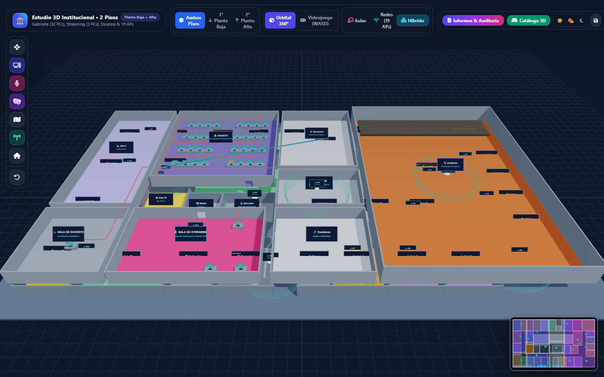
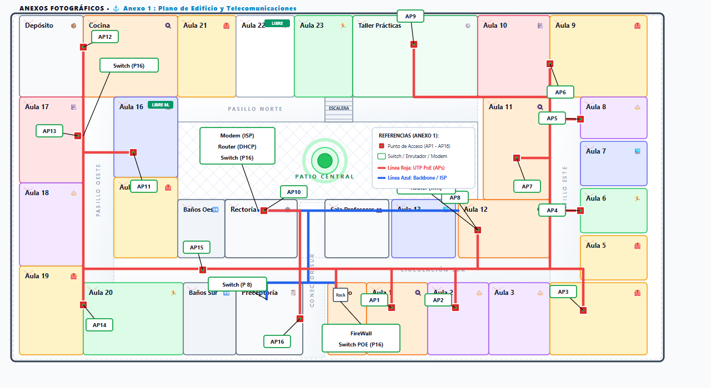
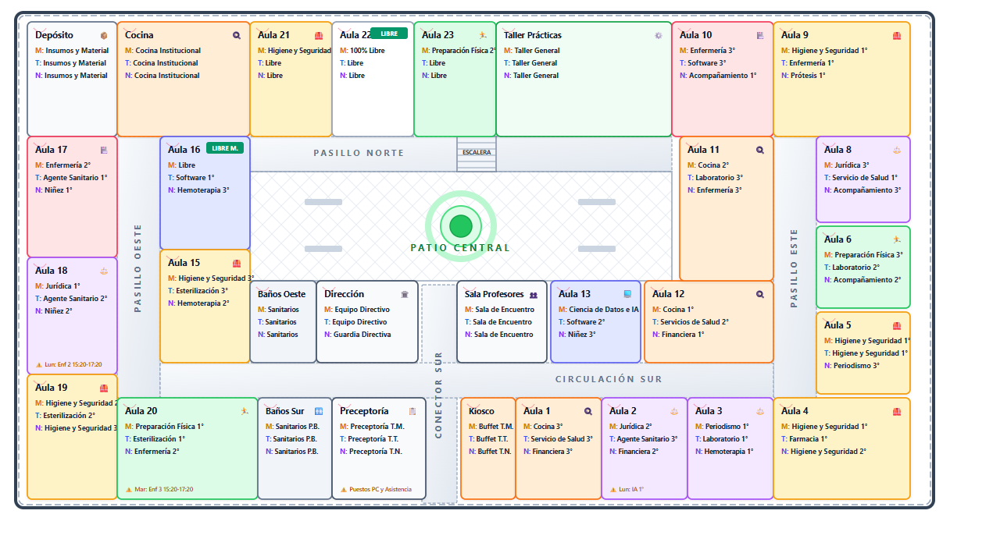

# 🏛️ Plataforma Institucional, Arquitectónica y de Telecomunicaciones (3D & 2D)

[](https://threejs.org/)
[](https://threejs.org/)
[](https://tailwindcss.com/)
[](distribucion_aulas_editable.pptx)
[](index.html)

Suite integral y autónoma para el **relevamiento arquitectónico de aulas**, gestión de **turnos académicos** y diseño de la **red Wi-Fi institucional de alta densidad (AP1 a AP16)** correspondiente al **Anexo 1 Oficial: Plano de Edificio y Telecomunicaciones**.

Incluye un **Simulador 3D y Videojuego en Primera Persona (WASD)** con editor sandbox, un **Plano Interactivo 2D con 2 secciones**, una **Presentación Ejecutiva en PowerPoint (.pptx)** con formas 100% desbloqueadas y vectoriales, y planos en alta definición (`.png` y `.svg`).

---

## 📸 Vistas Previas

### 1. Simulador 3D y Videojuego Escolar (Three.js WebGL)


### 2. Plano Oficial de Redes y Telecomunicaciones (Anexo 1)


### 3. Plano Institucional de Aulas y Turnos Multiturno


---

## 🚀 Inicio Rápido (Uso Local en tu PC)

No se requiere instalar Node.js, `npm`, ni ejecutar servidores en segundo plano. Todo funciona al **100% con doble clic**:

1. Descarga o clona la carpeta en tu computadora.
2. Abre cualquiera de los siguientes archivos en tu navegador (Google Chrome, Microsoft Edge, Firefox):
   - **`index.html`**: Portal central con acceso a todos los módulos.
   - **`simulador_3d_interactivo.html`**: Simulador 3D y videojuego en primera persona.
   - **`plano_institucional_interactivo.html`**: Editor y visor 2D con Sección 1 (Aulas) y Sección 2 (Redes).
   - **`distribucion_aulas_editable.pptx`**: Presentación PowerPoint oficial editable.

---

## 📂 Estructura del Proyecto

```text
Plano_Aulas_Presentacion/
│
├── index.html                           # Portal central de bienvenida (ideal para GitHub Pages)
├── simulador_3d_interactivo.html        # Simulador 3D y Videojuego Sandbox (Three.js)
├── plano_institucional_interactivo.html # Plano 2D interactivo (Sección 1 Aulas + Sección 2 Redes)
├── distribucion_aulas_editable.pptx     # Presentación ejecutiva oficial 16:9 editable
│
├── simulador_3d_vista.png               # Captura en alta resolución del Simulador 3D
├── plano_redes_presentacion.png         # Plano de telecomunicaciones oficial en imagen HD
├── plano_redes_telecomunicaciones.svg   # Vector SVG nítido del tendido de red (Anexo 1)
├── plano_presentacion.png               # Plano general de aulas en imagen HD
├── plano_arquitectonico_limpio.svg      # Vector SVG arquitectónico base
│
├── lib/                                 # Librerías 3D locales para funcionamiento 100% offline
│   ├── three.min.js                     # Motor Three.js r128 minificado
│   └── OrbitControls.js                 # Control de cámara orbital Three.js
│
├── .gitignore                           # Archivos ignorados por Git
└── README.md                            # Documentación técnica completa
```
## 🎮 Guía de Uso del Simulador 3D y Videojuego

### 1. Control de Niveles y Modos de Cámara
- **🏢 Selector de Pisos (Niveles):**
  - **Ambos Pisos:** Visualiza el edificio institucional completo en dos plantas superpuestas con el patio central abierto al cielo.
  - **1° Planta Baja:** Vista aislada del primer piso (Aulas 1 a 23, Dirección, Preceptoría con 4 PCs, Kiosco con Rack 42U y AP1 a AP16).
  - **2° Planta Alta:** Vista enfocada del segundo piso (Gabinete de 32 PCs, Sala de Streaming con 3 PCs, Sala Docente, Aula Oeste, Auditorio y AP17 a AP19).
- **🏛️ Vista 3D Orbital (Dios / Arquitecto):**
  - **Clic Izquierdo + Arrastrar:** Rotación 360° en torno al edificio.
  - **Clic Derecho + Arrastrar:** Desplazar / Panorámica.
  - **Rueda del Ratón:** Zoom continuo hacia adentro o afuera.
  - **Botón Plano Cenital:** Conmuta a vista superior ortogonal directa (mapa 2D en 3D).
  - **Botones de Enfoque Rápido:** Salto instantáneo a *Gabinete*, *Streaming* o *Auditorio*.
- **🎮 Modo Videojuego en 1ª Persona (Walkthrough WASD):**
  - Haz clic en **"Videojuego (WASD)"** y haz clic en la pantalla para tomar el control.
  - **`W, A, S, D`**: Caminar por pasillos y cruzar puertas físicas transitables para entrar a las aulas.
  - **`Escalera 3D Transitable`**: Sube físicamente por los escalones desde la Planta Baja hasta la Planta Alta de forma fluida.
  - **`1` y `2`**: Atajos de teclado para teletransportarte de inmediato entre Planta Baja y Planta Alta.
  - **`Shift`**: Correr.
  - **`Tab` o `Esc`**: Salir del modo videojuego.

### 2. Espacios del Segundo Piso (Planta Alta)
- **💻 GABINETE (Laboratorio Principal de Computación):** 8 mesas dobles de trabajo organizadas en 4 filas con pasillo central, equipadas con **32 computadoras de escritorio** (`PC-GAB-01` a `PC-GAB-32`), Switch PoE de distribución de 48 puertos (`SW-PA-GAB-01`), canaletas de red estructurada y AP17 de alta densidad en el techo.
- **🎙️ SALA DE STREAMING:** Estudio de producción audiovisual y podcasting con 3 estaciones de alto rendimiento (`PC-STR-01`, `PC-STR-02`, `PC-STR-03`) con cableado UTP directo al switch.
- **🧑‍🏫 SALA DE DOCENTE:** Oficina de coordinación y profesores de informática con PC docente.
- **📐 AULA OESTE:** Aula tradicional de teoría, diseño y arquitectura.
- **🚪 SALA PREVIA (Foyer):** Hall de acceso y distribución con punto de red.
- **🚻 BAÑOS:** Batería de sanitarios masculino y femenino.
- **🎭 AUDITORIO INSTITUCIONAL:** Salón de gran escala con escenario / tarima, luminarias y AP19 para alta densidad de concurrentes.

### 3. Catálogo 3D y Colocación Interactiva (Click-to-Place)
El botón **Catálogo 3D** despliega un inventario completo clasificado por pestañas:
- **🪑 Mobiliario Escolar:** Pupitre doble escolar, Silla ergonómica, Escritorio docente, Pizarra interactiva, Proyector de techo.
- **💻 Tecnología & Cómputo:** Computadora completa (Gabinete + Monitor + Teclado), Impresora departamental, Cámara domo CCTV.
- **📡 Telecomunicaciones:** Access Point Wi-Fi con domo de cobertura 3D, Switch PoE (8, 16 y 24 puertos), Router Gateway, Rack 42U de piso, Rosetas RJ45 de pared.
- **🏢 Espacios:** Aulas lectivas completas y pasillos conectores.

### 4. Ficha Técnica por Computadora & Foto de la Vida Real
Al hacer clic en cualquier PC en el 3D o en el dossier:
- **Número de Inventario / Service único:** Ej. `PC-GAB-01`, `PC-STR-01`, `PC-PREC-01`.
- **Modelo de Gabinete:** Torre ATX, Slim SFF, Mini PC, All-in-One.
- **Sistema Operativo:** Windows 11 Pro, Windows 10 Educativo, Ubuntu Linux, Debian, Dual Boot.
- **Especificaciones de Hardware:** Procesador (CPU), Memoria RAM, Almacenamiento.
- **Estado de Mantenimiento:** 🟢 100% Operativo, 🟡 En Mantenimiento / Revisión, 🔴 Fuera de Servicio.
- **📷 Subir Foto de la Vida Real:** Botón para cargar la fotografía física real tomada con el celular o cámara digital de la PC física o del rack. La foto queda guardada y se incrusta en los informes oficiales.
- **💻 Software y Aplicaciones Instaladas:** Etiquetas dinámicas por equipo (Cisco Packet Tracer, VS Code, AutoCAD, Office 365, OBS Studio, Python) con **Perfiles Rápidos** (Programación, Streaming, Diseño/CAD, Ofimática).

### 4. Generador Automático de Informes Oficiales & Auditoría
El botón **Informes & Auditoría** genera reportes consolidados en tiempo real:
1. **📋 1. General & Infraestructura:** Censo de aulas, capacidad de alumnos por turno (Mañana, Tarde, Noche), m² útiles y mobiliario.
2. **💻 2. Equipamiento Tecnológico & PCs:** Inventario exhaustivo de computadoras con número de service, modelo de gabinete, sistema operativo, software instalado y **fotos reales integradas**.
3. **📡 3. Redes & Telecomunicaciones (Anexo 1):** Balance de puertos PoE, listado de los 16 APs, IPs asignadas, switches y cableado UTP Cat6.
- **🖨️ Imprimir / Guardar en PDF (A4):** Formato formal con membrete institucional, tablas estilizadas, fotos físicas y campo de firmas para entrega de auditoría o directivos.
- **📊 Descargar Excel (.csv):** Exportación completa para abrir en Excel o Google Sheets.

### 5. Editor Sandbox 3D (Añadir, Modificar, Eliminar)
- **Seleccionar e Inspeccionar:** Haz clic sobre cualquier aula o equipo para abrir el panel lateral de propiedades:
  - Cambiar nombre ("Aula 24", "Laboratorio de Robótica", etc.).
  - Asignar carreras y turnos (Mañana, Tarde, Noche).
  - Modificar categoría y color visual (Tecnología, Salud, Seguridad, Gastronomía, etc.).
  - Ajustar dimensiones en metros (Ancho X, Largo Z, Alto Y) y posición en planta.
- **🗑️ Eliminar y Duplicar:**
  - Pulsa **"Eliminar"** en el panel lateral o presiona la tecla `Supr` (`Delete`).
  - Pulsa **"Duplicar"** para clonar un objeto con un solo clic.
- **💾 Guardar / Cargar Proyecto:**
  - Guarda automáticamente en el navegador (`LocalStorage`) y permite exportar/importar maquetas completas en archivo `.json`.
- **📸 Captura HD:**
  - Descarga instantánea de fotos nítidas del render 3D en formato PNG.

---

## 📡 Especificaciones de Telecomunicaciones (Anexo 1 Oficial)

La capa de telecomunicaciones reproduce con precisión milimétrica la infraestructura de red instalada:

### Código de Tendido de Cableado Estructurado
- 🔴 **Línea Roja (Tendido PoE UTP Categoría 6):** Distribución de datos y energía desde el **Switch POE (P16)** en el Kiosco hacia los 16 APs a lo largo de las bandejas técnicas de los pasillos.
- 🔵 **Línea Azul (Troncal Backbone Core / ISP):** Enlace troncal gigabit que une el **Modem Fibra (ISP)** y **Router Gateway DHCP** en Rectoría, baja por el **Conector Sur** hacia el **Rack 42U** en Kiosco, y deriva a **Preceptoría** y al **Router Wi-Fi del Aula 12**.

---

## 🎨 Paleta de Especialidades Académicas

| Carrera / Área | Color Hex | Emoji | Ejemplos de Aulas |
| :--- | :---: | :---: | :--- |
| **Salud** | `#f43f5e` | 🏥 | Aula 10, Aula 17 (Enfermería) |
| **Seguridad** | `#f59e0b` | 🦺 | Aula 4, Aula 5, Aula 9, Aula 15, Aula 19, Aula 21 |
| **Tecnología** | `#6366f1` | 💻 | Aula 7, Aula 16, Taller Prácticas / Computación |
| **Sociales** | `#a855f7` | ⚖️ | Aula 2, Aula 3, Aula 8, Aula 18 (Jurídica / Periodismo) |
| **Gastronomía** | `#f97316` | 🍳 | Aula 1, Aula 11, Aula 12, Cocina Institucional |
| **Deportes** | `#22c55e` | 🏃 | Aula 6, Aula 20, Aula 23 (Preparación Física) |
| **Administración** | `#475569` | 🏛️ | Rectoría, Preceptoría, Sala de Profesores |
| **Servicios** | `#64748b` | 🔧 | Sanitarios Oeste, Sanitarios Sur, Kiosco, Depósito |
| **Libre / Disponible** | `#94a3b8` | ✨ | Aula 22, Patio Central |

---

## 🛠️ Tecnologías Utilizadas

- **Three.js (r128):** Renderizado WebGL 3D, sombras suaves PCF, materiales PBR e iluminación dinámica.
- **HTML5 Canvas 2D:** Generación procedural de texturas nítidas para letreros de aulas y minimap radar.
- **Tailwind CSS (v3):** Interfaz de usuario con paneles de vidrio translúcido (*glassmorphism*) y diseño responsivo.
- **Python `python-pptx`:** Generador automatizado de presentaciones de PowerPoint con formas vectoriales nativas desbloqueadas.
- **Vectores SVG Nativo:** Renderizado escalable para impresión en planos de gran formato sin pixelado.

---

## 📄 Licencia

Este proyecto ha sido desarrollado para uso institucional, técnico y académico. Código abierto bajo la licencia **MIT**.
